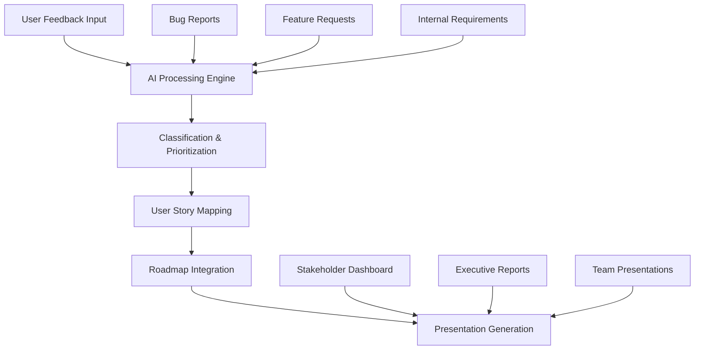

# Insight Manager UI

AI-powered product management platform that unifies feature requests, bug reports, and strategy into a living user-story map and roadmap. Transforms fragmented feedback into prioritised epics and exec-ready presentations with human-in-the-loop governance.

Note: Documentation lives in /doc, not /docs.

## Why this exists
Teams juggle feedback, bugs, and ideas across silos. This project proposes an AI ingestion and triage layer that clusters duplicates, extracts themes, proposes scope, and links every roadmap item back to evidence.

## Key features
- Unified Intake Hub: collect features, bugs, internal ideas in one place.
- AI triage and insights: dedupe, semantic clustering, sentiment, user impact scoring; root-cause hints for bugs.
- Prioritization: RICE/ICE/MoSCoW with explainable scoring and what-if scenarios.
- User Story Mapping: auto-generate story maps from clusters → epics → slices; drag-and-drop with AI assist.
- Roadmap views: Now/Next/Later, quarterly, and theme-based.
- Presentation generation: one-click briefs, slides, release notes, shareable web views.
- Governance & lineage: evidence pins linking feedback → roadmap items; approval workflows; audit log.
- Integrations (concept): Jira/Linear, GitHub, Slack, Intercom/Zendesk, Notion/Confluence, Mixpanel/GA, LaunchDarkly.

## Architecture (concept)

Shared architecture notes:
- Pipelines: Ingestion → PII redaction → Embedding store → Clustering (HDBSCAN/graph) → Ranking (impact, frequency, sentiment) → Drafting (LLM) → Human review.
- Explainability: every AI suggestion shows evidence, assumptions, editable scoring.
- Human-in-the-loop: approvals required before syncing to Jira/Linear.
- Compliance: SSO, RBAC, tenant isolation, data retention.

## MVP (proposed)
- Ingestion: CSV + Slack + Jira/Linear + Intercom.
- Clustering/dedup + basic RICE + Story Map generation.
- Now/Next/Later roadmap + slide export.
- Feedback lineage + simple roles/permissions.

## Success metrics (examples)
- ≥60% reduction in manual triage time.
- ≥30% increase in “feedback referenced in roadmap” rate.
- Intake → planned epic median time ≤48h.
- ≥70% epics with metric linkage.
- ≥80% bugs auto-grouped to owner team.
- Exec review prep time −70%.
- ≥90% roadmap items with evidence links.
- Stakeholder satisfaction ≥4.5/5.

## Naming options
From docs: ProductMind AI, RoadmapIQ, FeatureCraft Studio; SignalScope, StoryGrid AI, Weaveboard. Package uses: insight-manager-ui.

---

## Tech stack
- Framework: SvelteKit ^2.22 (Svelte ^5)
- Build: Vite ^7 (vite.config.ts)
- Styling: Tailwind CSS ^4 with @tailwindcss/forms and @tailwindcss/typography (src/app.css)
- UI Components: shadcn-svelte style; example Button at src/lib/components/ui/button
- i18n: inlang Paraglide (project.inlang/settings.json, messages/en.json, messages/es.json, messages/pt.json, messages/ja.json)
- Testing: Vitest (browser + node) and Playwright e2e
- Adapter: @sveltejs/adapter-vercel (svelte.config.js)

## Getting started
1) Install deps
- npm install

2) Develop
- npm run dev
- npm run dev -- --open (open browser)

3) Build & preview
- npm run build
- npm run preview

## Scripts (from package.json)
- dev: vite dev
- build: vite build
- preview: vite preview
- prepare: svelte-kit sync
- check: svelte-kit sync && svelte-check --tsconfig ./tsconfig.json
- check:watch: svelte-kit sync && svelte-check --tsconfig ./tsconfig.json --watch
- test:unit: vitest
- test:e2e: playwright test
- test: npm run test:unit -- --run && npm run test:e2e

## Project structure highlights
- src/routes/+page.svelte – uses Button component
- src/routes/demo – demo index linking to Paraglide demo
- src/routes/demo/paraglide/+page.svelte – locale switch demo (setLocale)
- src/lib/components/ui/button – UI Button component (button.svelte, index.ts)
- src/lib/utils.ts – cn utility and WithElementRef type
- src/app.css – Tailwind setup (imports + plugins)
- src/app.html – uses %paraglide.lang% placeholder
- src/hooks.server.ts – sets HTML lang via Paraglide middleware
- vite.config.ts – tailwindcss and paraglide plugins; Vitest multi-project config
- svelte.config.js – Vercel adapter
- components.json – shadcn-svelte aliases
- project.inlang/settings.json – configured locales and message format

## i18n (Paraglide) notes
- Messages live in /messages/*.json (en, es, pt, ja).
- Demo route: /demo/paraglide shows language switching via setLocale from $lib/paraglide/runtime.
- HTML lang is set in src/app.html via %paraglide.lang% and hooks.server.ts.

## UI components
- Import example: import { Button } from '$lib/components/ui/button/index.js'
- Variants defined with tailwind-variants in src/lib/components/ui/button/button.svelte

## Testing
- Unit/component (Vitest): npm run test:unit
  - Browser project uses vitest-browser-svelte and Playwright provider; setup in vitest-setup-client.ts.
  - Example: src/routes/page.svelte.spec.ts
- E2E (Playwright): npm run test:e2e
  - Config: playwright.config.ts (build+preview webServer)
  - Example: e2e/demo.test.ts

## Demo
- Home: /
- Paraglide demo: /demo → /demo/paraglide

## Deployment
- Uses @sveltejs/adapter-vercel. See SvelteKit adapters: https://svelte.dev/docs/kit/adapters

## Docs
- Concept (Claude): doc/plan/00-concept-claude-idea.md
- Concept (GPT-5): doc/plan/00-concept-gpt-5-idea.md

## License
- MIT – see LICENSE
---

Rationale and sources for the above content:
- Architecture diagram copied from doc/plan/00-concept-claude-idea.md (mermaid block).
- MVP, KPIs, and shared architecture notes consolidated from doc/plan/00-concept-gpt-5-idea.md.
- Tech stack and paths verified from package.json, vite.config.ts, svelte.config.js, components.json, project.inlang/settings.json, messages/*.json, src/routes, and src/lib.

