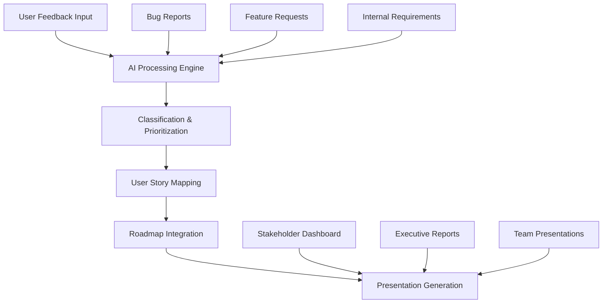

# AI-Powered Product Management Platform

Here are 3 name ideas with detailed project descriptions for your AI-driven product management application:

## 1. **ProductMind AI**

### Project Description

ProductMind AI is an intelligent product management platform that revolutionizes how teams handle feature requests, bug reports, and roadmap planning. By leveraging advanced AI capabilities, the platform automatically categorizes, prioritizes, and connects user feedback to strategic product decisions.

**Key Features:**

- **Smart Intake System**: AI automatically classifies incoming requests as features, bugs, or enhancements
- **Intelligent Prioritization**: Machine learning algorithms analyze user impact, business value, and technical complexity
- **Dynamic User Story Mapping**: AI-assisted story map generation based on user feedback patterns
- **Automated Roadmap Sync**: Real-time alignment between user requests and product roadmap
- **Presentation Builder**: AI-generated stakeholder reports and roadmap presentations

---

## 2. **RoadmapIQ**

### Project Description

RoadmapIQ transforms chaotic product feedback into actionable intelligence through AI-powered analysis and strategic planning tools. The platform serves as a central nervous system for product teams, connecting user voice directly to product strategy execution.

**Key Features:**

- **Unified Feedback Hub**: Single interface for feature requests, bug reports, and user stories
- **AI-Driven Insights**: Natural language processing to extract themes and patterns from user feedback
- **Smart Story Mapping**: Automated user journey mapping with AI-suggested story hierarchies
- **Predictive Roadmapping**: AI recommendations for feature sequencing based on user behavior and market trends
- **Executive Dashboards**: Auto-generated presentations with data-driven product insights

---

## 3. **FeatureCraft Studio**

### Project Description

FeatureCraft Studio is an AI-native product management workspace that seamlessly blends user feedback collection, strategic planning, and roadmap execution. The platform empowers product managers to craft compelling product narratives backed by intelligent data analysis and automated workflow optimization.

**Key Features:**

- **AI Feedback Orchestrator**: Intelligent routing and categorization of all user inputs
- **Story Weaving Engine**: AI-assisted user story creation and mapping from raw feedback
- **Impact Prediction Models**: Machine learning algorithms that forecast feature success rates
- **Collaborative Roadmap Canvas**: Interactive planning interface with AI-powered recommendations
- **Narrative Presentation Suite**: Automated generation of compelling product stories for stakeholders

---

## Recommended Architecture Overview

Each platform concept focuses on transforming fragmented product feedback into cohesive, AI-driven product strategy execution while maintaining seamless integration between all components of the product management lifecycle.
